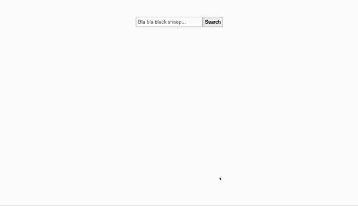

# Simple Image Search using CLIP & Faiss

All images are fed into [CLIP](https://github.com/openai/CLIP) image encoder to get embeddings. These embeddings are then indexed using [Faiss](https://github.com/facebookresearch/faiss). Inner product (cosine) is used as similarity metric.
Search is done by extracting embedding of query text using CLIP text encoder and then finding nearest neighbors in the index.

## Demo



Dataset used: [Animal Image Dataset](https://www.kaggle.com/datasets/iamsouravbanerjee/animal-image-dataset-90-different-animals)

## Files
```commandline
├── README.md                  # This file
├── requirements.txt           # Requirements file
├── index.py                   # Create index for search
├── app.py                     # Search app in CLI
├── server.py                  # Search app in Flask
├── templates                  # HTML templates for Flask app
│   ├── index.html             
├── static                     # Static files for Flask app
│   ├── styles.css             
│   ├── app.js                 
├── data                       
│   ├── images                 # Images for search
```